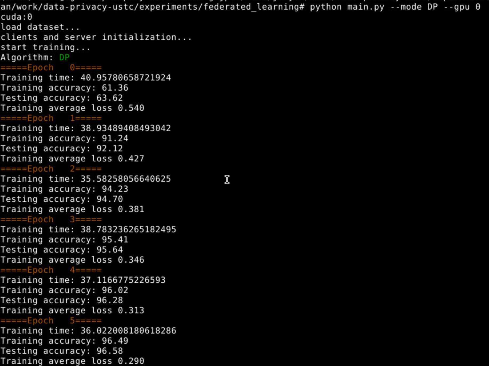

# Privacy Preserving Federated Learning

**郑龙韬 PB18061352**
**7/10/2021**

## User Guide

### Prerequisite

```bash
sudo apt install libgmp-dev
sudo apt install libmpc-dev 
pip install gmpy2
pip install phe
pip install termcolor
```

In addition, `torch` is the framework for training.

### Run

#### Plain

Run with CPU:

```bash
python main.py --gpu -1
```

Run with GPU(ID=0):

```bash
python main.py --gpu 0
```

Results:

> Note: Through this report, the elapsed time is measured by seconds.


#### Differential Privacy

run with GPU(ID=0):

```bash
python main.py --gpu 0 --mode DP
```

Results:



#### Paillier

run with GPU(ID=0):

```bash
python main.py --gpu 0 --mode Paillier
```

Results:


See more argument options in [options.py](options.py).

## Differential Privacy in Federated Learning

### Key Implementation

#### Server code

In `FedAvg` method:

```py
elif self.args.mode == 'DP':  # DP mechanism
    update_w_avg = copy.deepcopy(self.clients_update_w[0])
    for k in update_w_avg.keys():
        for i in range(1, len(self.clients_update_w)):
            update_w_avg[k] += self.clients_update_w[i][k]
        # add gauss noise
        update_w_avg[k] += torch.normal(0, self.sigma**2 * self.C**2, update_w_avg[k].shape).to(self.args.device)
        update_w_avg[k] = torch.div(update_w_avg[k], len(self.clients_update_w))
        self.model.state_dict()[k] += update_w_avg[k]
```

#### Client code

In `train` method:

```py
elif self.args.mode == 'DP':  # DP mechanism
    for k in w_new.keys():
        update_w[k] = w_new[k] - w_old[k]
        # L2-norm
        sensitivity = torch.norm(update_w[k], p=2)
        # clip
        update_w[k] = update_w[k] / max(1, sensitivity / self.C)
```

The `update` method for DP is the same as plain federated learning, the code is as follows.

```py
if self.args.mode == 'plain' or self.args.mode == 'DP':
    self.model.load_state_dict(w_glob)
```

#### Add DP default arguments

Both in `options.py` and the `__init__` methods of clients and server

In `options.py`:

```py
# DP arguments
parser.add_argument('--C', type=int, default=0.5, help="DP model clip parameter")
parser.add_argument('--sigma', type=int, default=0.05, help="DP Gauss noise parameter")
```

In `__init__` method of clients:

```py
# DP hyperparameters
self.C = self.args.C
```

In `__init__` method of server:

```py
# DP hyperparameters
self.C = self.args.C
self.sigma = self.args.sigma
```

### Experiments

The influence of $\sigma, C$ for model's accuracy

Accordingly, the $\epsilon$ is ($\delta = 10^{-3}$)

### Bonus

When $\sigma$ is small, it may result in $\epsilon \geq 1$, which contradicts the condition of theorem 3.22 (Classical Gauss Mechanism).

To address this issue, I investigate several papers:

1) Borja Balle, Yu-Xiang Wang. *Improving the Gaussian Mechanism for Differential Privacy: Analytical Calibration and Optimal Denoising*. [[ICML 2018](http://proceedings.mlr.press/v80/balle18a/balle18a.pdf)].

2) Jun Zhao et al. *Reviewing and Improving the Gaussian Mechanism for Differential Privacy*. [[arXiv 2019](https://arxiv.org/abs/1911.12060)].

3) Fang Liu. *Generalized Gaussian Mechanism for Differential Privacy* [[TKDE 2019](https://arxiv.org/pdf/1602.06028.pdf)].

#### Classical Gaussian Mechanism cannot be extended to $\epsilon > 1$

In section 2.3 of the 1st paper, the authors answer the **question**: whether the order of magnitude $\sigma = \Theta(1/\epsilon)$ for $\epsilon \leq 1$ can be extended to privacy parameters of the form $\epsilon > 1$?

They show this is not the case by providing the **lower bound** $\sigma \geq \Delta/\sqrt{2\epsilon}$ (theorem 4 in the paper). As $\epsilon \rightarrow \infty$, the upper bound on $\delta$ converges to $1/2$. Thus, as $\epsilon$ increases the range of $\delta$'s requiring noise of the order $\Omega(1/\sqrt{\epsilon})$ increases to include all parameters of practical interest. This shows that the rate $\sigma = \Theta(1/\epsilon)$ provided by the classical Gaussian mechanism **cannot be extended** beyond the interval $\epsilon \in (0, 1)$.

#### Other mechanisms that address this issue

##### The Analytic Gaussian Mechanism

In the 1st paper, the authors address these limitations by developing an **optimal Gaussian mechanism** whose **variance is calibrated directly using the Gaussian cumulative density function instead of a tail bound approximation**. 

In the 1st paper also propose to **equip the Gaussian mechanism with a post-processing step based on adaptive estimation techniques** by leveraging that the **distribution of the perturbation is known**.

---

## Paillier Cryptosystem

Paillier Cryptosystem is a probabilistic asymmetric algorithm for public key cryptography. The scheme is an additive homomorphic cryptosystem.

### Task 1: Principle of Paillier

In the following, there are 5 methods (`enc`, `dec`, `enc_add`, `enc_add_const`, `enc_mul_const`) filled with `gmpy2`, respectively.

```py

```

The `test` method (for correctness validation):
```py

```

The `main` of `paillier_test.py`:
```py

```

#### Results

The correctness of this implementations is shown in the following 2 figures. The `PASS` in green indicates the decrypted number after operations is equal to the ground truth.

In the case that the number is small:


In the case that the number is large:


The `enryption time`, `decryption time` and `total time` of:

- `enc_add`
- `enc_add_const`
- `enc_mul_const`

with 1024-bit keys and 10-1000 bits integers, shown in the following figure.


Therefore, it is safe to draw the conclusion that the elapsed time is related to the length of bits. As the bits increase, the time increases.

### Task 2: Paillier Federated Learning

#### Server code

In `FedAvg` method:

```py

```

#### Client code

In `train` method:

```py

```

In `update` method:

```py

```

#### Add Paillier default arguments

In the `__init__` method of clients:

```py
# Paillier initialization
if self.args.mode == 'Paillier':
    self.pub_key = global_pub_key
    self.priv_key = global_priv_key
```

#### Edit `main.py`

In this implementation of paillier federated learning, the server only conduct the summation (no model updating in the `FedAvg` process). Since the test is done by the model of server, it is needed to copy the model of clients to the server in `main.py` in the end of each epoch (before testing).

```py

```

#### Results

correct

running time in MNIST

### References

1) Borja Balle, Yu-Xiang Wang. *Improving the Gaussian Mechanism for Differential Privacy: Analytical Calibration and Optimal Denoising*. [ICML 2018](http://proceedings.mlr.press/v80/balle18a/balle18a.pdf).

2) Jun Zhao et al. *Reviewing and Improving the Gaussian Mechanism for Differential Privacy*. [arXiv 2019](https://arxiv.org/abs/1911.12060).

3) Fang Liu. *Generalized Gaussian Mechanism for Differential Privacy* [TKDE 2019](https://arxiv.org/pdf/1602.06028.pdf).

4) Martín Abadi, Andy Chu, Ian J. Goodfellow, H. Brendan McMahan, Ilya Mironov, Kunal Talwar, Li Zhang: Deep Learning with Differential Privacy. ACM Conference on Computer and Communications Security 2016: 308-318

5) Abadi, Martin, et al. Deep learning with differential privacy. Proceedings of the 2016 ACM SIGSAC conference on computer and communications security. 2016.

6) **Methodology, Ethics and Practice of Data Privacy** Course at University of Science and Technology of China. 2021 Spring. (**Lecturer: Prof. Lan Zhang**).
