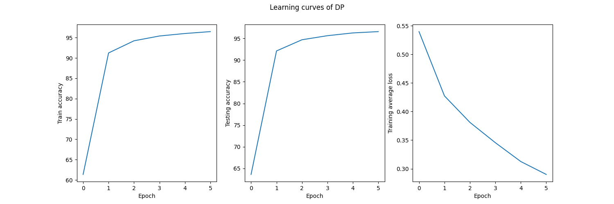
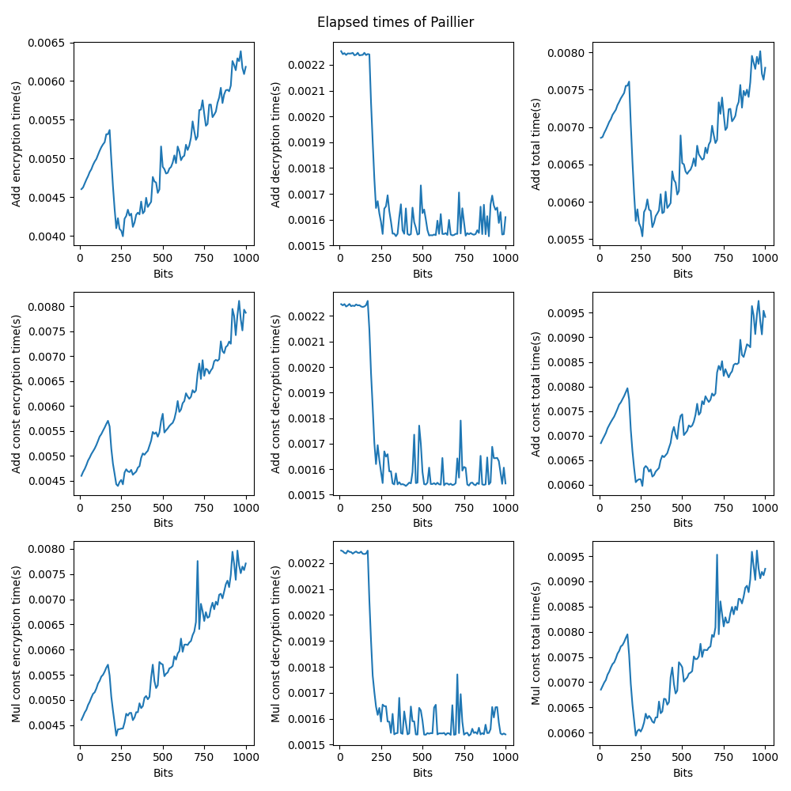
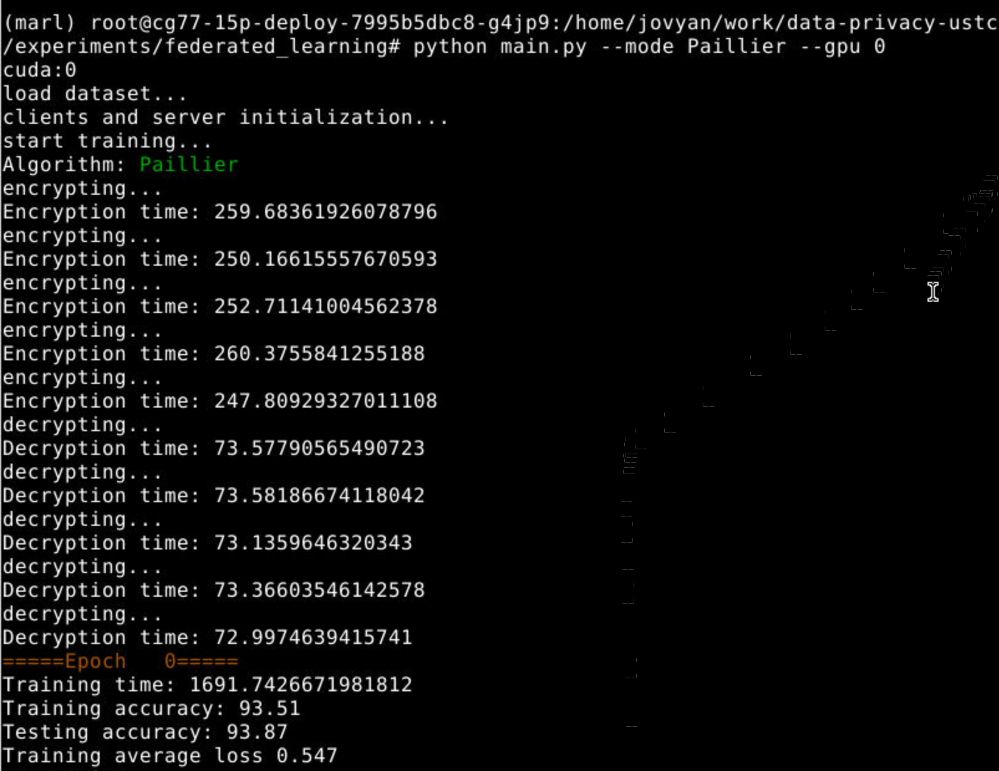

# Privacy Preserving Federated Learning

**7/10/2021**

## User Guide

### Prerequisite

```bash
sudo apt install libgmp-dev
sudo apt install libmpc-dev 
pip install gmpy2
pip install phe
pip install termcolor
```

In addition, `torch` is the framework for training.

### Plain

Run in CPU:

```bash
python main.py --gpu -1
```

Run in GPU(ID=0):

```bash
python main.py --gpu 0
```

### Differential Privacy

Run in GPU(ID=0) with $C=0.5$ and $\sigma=0.05$:

```bash
python main.py --gpu 0 --mode DP --C 0.5 --sigma 0.05
```

### Paillier

Run in GPU(ID=0):

```bash
python main.py --gpu 0 --mode Paillier
```

See more argument options in [options.py](options.py).

> Note: Through this report, the time is measured by seconds.

## Differentially Private Federated Learning

### Key Implementation

$$
w_{t+1}=w_t+\frac{1}{k}(\sum_{i=0}^{k}\Delta w^i/\max(1,\frac{\|\Delta w^i\|_2}{C})+N(0,\sigma^2C^2I))
$$

#### Server code

In `FedAvg` method, add gauss noise $N(0,\sigma^2C^2I)$ for the update weight sum and then apply the average operation.

```py
elif self.args.mode == 'DP':  # DP mechanism
    update_w_avg = copy.deepcopy(self.clients_update_w[0])
    for k in update_w_avg.keys():
        for i in range(1, len(self.clients_update_w)):
            update_w_avg[k] += self.clients_update_w[i][k]
        # add gauss noise
        update_w_avg[k] += torch.normal(0, self.sigma**2 * self.C**2, update_w_avg[k].shape).to(self.args.device)
        update_w_avg[k] = torch.div(update_w_avg[k], len(self.clients_update_w))
        self.model.state_dict()[k] += update_w_avg[k]
```

#### Client code

In `train` method, replace the $\sum_{i=0}^{k} \Delta w^i$ in plain federated learning with $\sum_{i=0}^{k}\Delta w^i/\max(1,\frac{\|\Delta w^i\|_2}{C})$ as the following code.

```py
elif self.args.mode == 'DP':  # DP mechanism
    for k in w_new.keys():
        update_w[k] = w_new[k] - w_old[k]
        # L2-norm
        sensitivity = torch.norm(update_w[k], p=2)
        # clip
        update_w[k] = update_w[k] / max(1, sensitivity / self.C)
```

The `update` method for DP is the same as plain federated learning, the code is as follows.

```py
if self.args.mode == 'plain' or self.args.mode == 'DP':
    self.model.load_state_dict(w_glob)
```

#### Add DP default arguments

Both in `options.py` and the `__init__` methods of clients and server.

In `options.py`:

```py
# DP arguments
parser.add_argument('--C', type=float, default=0.5, help="DP model clip parameter")
parser.add_argument('--sigma', type=float, default=0.05, help="DP Gauss noise parameter")
```

In `__init__` method of clients:

```py
# DP hyperparameters
self.C = self.args.C
```

In `__init__` method of server:

```py
# DP hyperparameters
self.C = self.args.C
self.sigma = self.args.sigma
```

### Results

The results with default parameter settings: $C=0.5$ and $\sigma=0.05$. The accuracy converges near 96% after training 6 epochs. More results are illustrated in the next section.


DP learning curve (train/test accuracy and loss):



### Experiments

> Experiment condition: $C \in [0.1, 0.9]$ and $\sigma \in [0.1, 0.4]$. The experiment code is implemented in [dp_tune.py](dp_tune.py). The results are in the several graphs below. Due to limited computation resource, each training/testing accuracy and loss are measured after training 2 epochs at only 1 time (There may exists randomness. The relationship between the parameters and accuracy, however, is clear).

#### Influence of $\sigma, C$ for model's accuracy

Results in terminal:


3D visualization:

- DP train accuracy:


- DP test accuracy:


#### Analysis

Generally, within the parameters' range of experiments

- large $\sigma$ will harm the train/test accuracy

- large $C$ will reduce the train/test accuracy

These results are reasonable since the higher the $\sigma$ is, the more noises are added and $C$ bounds the gradient norm.

#### Values of $\epsilon$

With $\delta = 10^{-3}$, the according $\epsilon$ given $C$ and $\sigma$ is shown below. Also, the exact values of $\epsilon$ given $C$ and $\sigma$ are shown in the former figure (results in terminal).


### Bonus

When $\sigma$ is small, it may result in $\epsilon \geq 1$, which contradicts the condition of theorem 3.22 (i.e. Classical Gauss Mechanism).

To address this issue, there exist several papers:

1) Borja Balle, Yu-Xiang Wang. *Improving the Gaussian Mechanism for Differential Privacy: Analytical Calibration and Optimal Denoising*. [[ICML 2018](http://proceedings.mlr.press/v80/balle18a/balle18a.pdf)].

2) Jun Zhao et al. *Reviewing and Improving the Gaussian Mechanism for Differential Privacy*. [[arXiv 2019](https://arxiv.org/abs/1911.12060)].

3) NhatHai Phan et al. *Heterogeneous Gaussian Mechanism: Preserving Differential Privacy in Deep Learning with Provable Robustness*. [[arXiv 2019](https://arxiv.org/pdf/1906.01444.pdf)].

and conclude the following points.

#### i) Usage of $\epsilon > 1$

Although $\epsilon \leq 1$ is preferred in practical applications, there are still cases where $\epsilon > 1$ is used, so it is necessary to have Gaussian mechanisms which apply to not only $\epsilon \leq 1$ but also $\epsilon > 1$. For example, the Differential Privacy Synthetic Data Challenge organized by the National Institute of Standards and Technology (NIST) included experiments of $\epsilon$ as 10. Also, for a variant of differential privacy called **local differential privacy** which is implemented in several industrial applications (e.g. Apple and Google) have adopted $\epsilon > 1$.

#### ii) Classical Gaussian Mechanism cannot be extended to $\epsilon > 1$

In section 2.3 of the 1st paper, the authors answer the **question**: whether the order of magnitude $\sigma = \Theta(1/\epsilon)$ for $\epsilon \leq 1$ can be extended to privacy parameters of the form $\epsilon > 1$?

They show this is not the case by providing the **lower bound** $\sigma \geq \Delta/\sqrt{2\epsilon}$ (theorem 4 in the paper). As $\epsilon \rightarrow \infty$, the upper bound on $\delta$ converges to $1/2$. Thus, as $\epsilon$ increases the range of $\delta$'s requiring noise of the order $\Omega(1/\sqrt{\epsilon})$ increases to include all parameters of practical interest. This shows that the rate $\sigma = \Theta(1/\epsilon)$ provided by the classical Gaussian mechanism **cannot be extended** beyond the interval $\epsilon \in (0, 1)$.

In the 2nd paper, the fact that classical Gaussian mechanism do not achieve $(\epsilon, \delta)$-DP for large $\epsilon$ given $\delta$ is also shown.

#### iii) Mechanisms that address this issue

##### Analytic Gaussian Mechanism (1st paper)

In the 1st paper, the authors address these limitations by developing an **optimal Gaussian mechanism** whose variance is calibrated directly using the Gaussian cumulative density function instead of a tail bound approximation.


This algorithm is proven to satisfy $(\epsilon, \delta)$-DP for **any** $\epsilon \geq 0$ and $\delta \in [0, 1]$, let $f$ be a function with global $L_2$ sensitivity $\Delta$) by the theorem 8 and 9 in the paper.

In the 1st paper they also propose to equip the Gaussian mechanism with a post-processing step based on adaptive estimation techniques by leveraging that the distribution of the perturbation is known. The authors presents it as Optimal Denoising.

##### New Gaussian Mechanisms proposed by Jun Zhao et al. (2nd paper)

In the 2nd paper, the authors propose Gaussian mechanisms by deriving closed-form upper bounds for $\sigma_{DP-OPT}$. Their mechanisms achieve $(\epsilon, \delta)$-DP for **any** $\epsilon$, while the classical Gaussian mechanisms do not. This paper is an further extension based on the 1st paper.

They argue that $\sigma_{DP-OPT}$ is in the form of $\Theta(\frac{1}{\sqrt{\epsilon}})$ for large $\epsilon$ (which is smaller than $\Theta(\frac{1}{\epsilon})$ for $\epsilon > 1$). It gives the minimal required amount of noise when the noise follows a Gaussian distribution. Based on $\sigma_{DP-OPT}$, the Mechanism 1 and Mechanism 2 of their proposals to achieve $(\epsilon, \delta)$-DP are simpler and more computationally efficient than DP-OPT.

Theorem 4 and 5 in that paper presents their Mechanism 1 and 2 to achieve $(\epsilon, \delta)$-DP, respectively.


##### Extended Gaussian Mechanisms (3rd paper)

Here the authors relax the constraint of the privacy budget in the classical Gaussian Mechanism from $(0, 1]$ to $(0, \infty)$, with a new bound of the noise scale to preserve differential privacy.


##### Heterogeneous Gaussian Mechanisms (3rd paper)

For Extended Gaussian Mechanism, the noise scale $\sigma$ is used to inject Gaussian noise into each component. This may not be optimal, since different components usually have different impacts to the model outcomes. The paper further proposes a Heterogeneous Gaussian Mechanism (HGM), in which the noise scale $\sigma$ can be arbitrarily redistributed. Different strategies can be applied to improve the model utility and to enrich the search space for better robustness bounds.


---

## Paillier Cryptosystem

Paillier Cryptosystem is a probabilistic asymmetric algorithm for public key cryptography. The scheme is an additive homomorphic cryptosystem.

### Task 1: Paillier with gmpy2

In the following, there are 5 methods (`enc`, `dec`, `enc_add`, `enc_add_const`, `enc_mul_const`) filled with `gmpy2`, respectively.

#### Encryption

$$
c=g^m\cdot r^n\ mod\ n^2 = (g^m\ mod\ n^2 \cdot r^n\ mod\ n^2)\ mod\ n^2
$$

```py
def enc(pub, plain):
    """Parameters: public key, plaintext"""

    def generate_r(n):
        """generate a random number s.t. gcd(r, n) = 1"""    
        while True:
            r = mpz(random.randint(1, n - 1))
            if gcd(r, n) == 1:
                return r
    
    # Mathematically:
    # (a * b) mod c = (a mod c * b mod c) mod c
    # c = (g^m * r^n) mod n^2 = (g^m mod n^2 * r^n mod n^2) mod n^2
    g, n, n_sq = pub.g, pub.n, pub.n_sq
    r = generate_r(n)
    cipher = powmod(powmod(g, plain, n_sq) * powmod(r, n, n_sq), 1, n_sq)
    return cipher
```

#### Decryption

$$
m=L(c^\lambda \ mod\ n^2)\cdot \mu\ mod\ n
$$

where $L(x)=\lfloor(x-1)/n\rfloor$.

```py
def dec(priv, pub, cipher):
    """Parameters: private key, public key, cipher"""
    n, n_sq = pub.n, pub.n_sq
    x = powmod(cipher, priv.l, n_sq)
    L = f_div(x - 1, n)
    plain = powmod(mpz(L * priv.m), 1, n)
    return plain
```

#### Add & Mul

```py
def enc_add(pub, m1, m2):
    """Add one encrypted integer to another"""
    return powmod(m1 * m2, 1, pub.n_sq)

def enc_add_const(pub, m, c):
    """Add a constant to an encrypted integer"""
    n_sq = pub.n_sq
    return powmod(powmod(m, 1, n_sq) * powmod(pub.g, c, n_sq), 1, n_sq)

def enc_mul_const(pub, m, c):
    """Multiply an encrypted integer by a constant"""
    return powmod(m, c, pub.n_sq)
```

#### Test and Plot

The `test` method (for correctness validation):
```py
def test(mode, bit_len, priv, pub):

    def generate_num(bit_len):
        return mpz(2)**(bit_len - 1) + mpz_urandomb(rand, bit_len - 1)
    
    elapsed_times = {}
    print('=====TEST ' + mode + '=====')
    a = generate_num(bit_len)
    b = generate_num(bit_len)
    c = generate_num(bit_len)

    enc_start = time.time()
    m1 = enc(pub, a)
    m2 = enc(pub, b)
    if mode == 'enc_add':
        enc_plain = enc_add(pub, m1, m2)
        enc_end = time.time()
        ground_truth = powmod(a + b, 1, pub.n)
        print('a:', a, '\tb:', b, '\tground_truth(a+b mod n):', ground_truth)
    elif mode == 'enc_add_const':
        enc_plain = enc_add_const(pub, m1, c)
        enc_end = time.time()
        ground_truth = powmod(a + c, 1, pub.n)
        print('a:', a, '\tc:', c, '\tground_truth(a+c mod n):', ground_truth)
    elif mode == 'enc_mul_const':
        enc_plain = enc_mul_const(pub, m1, c)
        enc_end = time.time()
        ground_truth = powmod(a * c, 1, pub.n)
        print('a:', a, '\tc:', c, '\tground_truth(a*c mod n):', ground_truth)
    else:
        raise NotImplementedError

    dec_start = time.time()
    dec_cipher = dec(priv, pub, enc_plain)
    dec_end = time.time()
    print('dec_cipher:', dec_cipher)

    if dec_cipher == ground_truth:
        print(colored('=====PASS=====', 'green'))
    else:
        print(colored('=====FAIL=====', 'red'))
    
    elapsed_times['enc'] = enc_end - enc_start
    elapsed_times['dec'] = dec_end - dec_start
    return elapsed_times
```

The `main` of `paillier_test.py` (test and plot):
```py
if __name__ == '__main__':
    priv, pub = generate_keypair(1024)
    add_enc_times = []
    add_dec_times = []
    add_const_enc_times = []
    add_const_dec_times = []
    mul_const_enc_times = []
    mul_const_dec_times = []

    for bit_len in range(10, 1000 + 10, 10):
        elapsed_times = {}
        elapsed_times['enc_add'] = test('enc_add', bit_len, priv, pub)
        elapsed_times['enc_add_const'] = test('enc_add_const', bit_len, priv, pub)
        elapsed_times['enc_mul_const'] = test('enc_mul_const', bit_len, priv, pub)
        
        add_enc_times.append(elapsed_times['enc_add']['enc'])
        add_dec_times.append(elapsed_times['enc_add']['dec'])
        add_const_enc_times.append(elapsed_times['enc_add_const']['enc'])
        add_const_dec_times.append(elapsed_times['enc_add_const']['dec'])
        mul_const_enc_times.append(elapsed_times['enc_mul_const']['enc'])
        mul_const_dec_times.append(elapsed_times['enc_mul_const']['dec'])

    # plot elapsed times
    x = list(range(10, 1000 + 10, 10))
    f, ((ax1, ax2, ax7), (ax3, ax4, ax8), (ax5, ax6, ax9)) = plt.subplots(ncols=3, nrows=3, figsize=(10, 10))
    plt.suptitle('Elapsed times of Paillier')
    ax1.plot(x, add_enc_times)
    ax1.set_xlabel('Bits')
    ax1.set_ylabel('Add encryption time(s)')
    ax2.plot(x, add_dec_times)
    ax2.set_xlabel('Bits')
    ax2.set_ylabel('Add decryption time(s)')
    ax3.plot(x, add_const_enc_times)
    ax3.set_xlabel('Bits')
    ax3.set_ylabel('Add const encryption time(s)')
    ax4.plot(x, add_const_dec_times)
    ax4.set_xlabel('Bits')
    ax4.set_ylabel('Add const decryption time(s)')
    ax5.plot(x, mul_const_enc_times)
    ax5.set_xlabel('Bits')
    ax5.set_ylabel('Mul const encryption time(s)')
    ax6.plot(x, mul_const_dec_times)
    ax6.set_xlabel('Bits')
    ax6.set_ylabel('Mul const decryption time(s)')
    ax7.plot(x, [t1 + t2 for t1, t2 in zip(add_enc_times, add_dec_times)])
    ax7.set_xlabel('Bits')
    ax7.set_ylabel('Add total time(s)')
    ax8.plot(x, [t1 + t2 for t1, t2 in zip(add_const_enc_times, add_const_dec_times)])
    ax8.set_xlabel('Bits')
    ax8.set_ylabel('Add const total time(s)')
    ax9.plot(x, [t1 + t2 for t1, t2 in zip(mul_const_enc_times, mul_const_dec_times)])
    ax9.set_xlabel('Bits')
    ax9.set_ylabel('Mul const total time(s)')
    plt.tight_layout()
    plt.savefig('figs/paillier_time.png')
    plt.show()
```

#### Results

The correctness of this implementations is shown in the following 2 figures. The `PASS` in green indicates the decrypted number after operations is equal to the ground truth.

In the case that the number is small:


In the case that the number is large:


The `enryption time` (column 1), `decryption time` (column 2) and `total time` (column 3) of

- `enc_add` (row 1)
- `enc_add_const` (row 2)
- `enc_mul_const` (row 3)

with 1024-bit keys and 10-1000 bits integers, shown in the following figure (experiments conducted by 3 times).




Therefore, it is safe to draw the conclusion that the elapsed time is related to the length of bits. As the bits increase, the time increases. The drop of decryption time near 200 bits may result from certain optimization in `gmpy2`.

### Task 2: Paillier Federated Learning

#### Server code

In `FedAvg` method, the server is only responsible for the summation and average, and return the update average weights (rather than return the whole model as in the plain and DP cases).

```py
elif self.args.mode == 'Paillier':
    update_w_avg = copy.deepcopy(self.clients_update_w[0])
    
    for k in update_w_avg.keys():
        client_num = len(self.clients_update_w)
        for i in range(1, client_num):  # client-wise sum
            for j in range(len(update_w_avg[k])):  # element-wise sum
                update_w_avg[k][j] += self.clients_update_w[i][k][j]
        for j in range(len(update_w_avg[k])):  # element-wise avg
            update_w_avg[k][j] /= client_num
        
    return update_w_avg, sum(self.clients_loss) / len(self.clients_loss)
```

#### Client code

In `train` method, each client

1) flatten the local update weights from tensor to a 1D list

2) encrypt every elements in the 1D list

3) send the encrypted weight list to the server

4) measure the encryption time

```py
elif self.args.mode == 'Paillier':  # Paillier encryption
    print('encrypting...')
    enc_start = time.time()
    for k in w_new.keys():
        update_w[k] = w_new[k] - w_old[k]
        # flatten weight
        list_w = update_w[k].view(-1).cpu().tolist()
        # encryption
        for i, elem in enumerate(list_w):
            list_w[i] = self.pub_key.encrypt(elem)
        update_w[k] = list_w
    enc_end = time.time()
    print('Encryption time:', enc_end - enc_start)
```

In `update` method, each client

1) receive the encrypted update average weights (a 1D list)

2) decrypt every elements in the 1D list

3) reshape to a tensor in accord with the model parameters

4) update local model

5) measure the decryption time

```py
elif self.args.mode == 'Paillier':  # Paillier decryption
    # for paillier, w_glob is update_w_avg here
    update_w_avg = copy.deepcopy(w_glob)
    print('decrypting...')
    dec_start = time.time()
    for k in update_w_avg.keys():
        # decryption
        for i, elem in enumerate(update_w_avg[k]):
            update_w_avg[k][i] = self.priv_key.decrypt(elem)
        # reshape to original and update
        origin_shape = list(self.model.state_dict()[k].size())
        update_w_avg[k] = torch.FloatTensor(update_w_avg[k]).to(self.args.device).view(*origin_shape)
        self.model.state_dict()[k] += update_w_avg[k]
    dec_end = time.time()
    print('Decryption time:', dec_end - dec_start)
```

#### Add Paillier default arguments

In the `__init__` method of clients:

```py
# Paillier initialization
if self.args.mode == 'Paillier':
    self.pub_key = global_pub_key
    self.priv_key = global_priv_key
```

#### Edit `main.py`

In this implementation of paillier federated learning, the server only conduct the summation (no model updating in the `FedAvg` process). Since the test is done by the model of server, it is necessay to copy the model of clients to the server in `main.py` in the end of each epoch before testing.

```py
if args.mode == 'Paillier':
    server.model.load_state_dict(copy.deepcopy(clients[0].model.state_dict()))
```

#### Results

##### Correctness

The train/test accuracy and loss are shown below. The learning curves is similar to the results in plain federated learning, and the accuracy is high. Thus, it is reasonable that the implementation is correct (the results of plain version is shown in the next section).


##### Running time in MNIST

Besides training time, accuracy and loss, the time of paillier encryption and decryption is also measured (printed in terminal as follows).

Epoch 1:



After training 6 epochs:


Each encryption takes about 240 seconds, and each decryption takes about 70 seconds. The total training time per epoch is near 1600s.

> Device: GPU clusters of School of Computer Science at USTC (with 10 Intel(R) Xeon(R) Silver 4210 CPUs and 1 Nvidia GeForce RTX 2080Ti GPU)

In contrast, running plain version only takes near 36 seconds per epoch (shown in the figure below). It is apparent that the paillier encryption and decryption processes are quite slow.


### References

1) Martín Abadi, Andy Chu, Ian J. Goodfellow, H. Brendan McMahan, Ilya Mironov, Kunal Talwar, Li Zhang: *Deep Learning with Differential Privacy*. ACM Conference on Computer and Communications Security 2016.

2) Borja Balle, Yu-Xiang Wang. *Improving the Gaussian Mechanism for Differential Privacy: Analytical Calibration and Optimal Denoising*. [ICML 2018](http://proceedings.mlr.press/v80/balle18a/balle18a.pdf).

3) Jun Zhao et al. *Reviewing and Improving the Gaussian Mechanism for Differential Privacy*. [arXiv 2019](https://arxiv.org/abs/1911.12060).

4) NhatHai Phan et al. *Heterogeneous Gaussian Mechanism: Preserving Differential Privacy in Deep Learning with Provable Robustness*. [[arXiv 2019](https://arxiv.org/pdf/1906.01444.pdf)].

5) **Methodology, Ethics and Practice of Data Privacy** Course at University of Science and Technology of China. 2021 Spring. (**Lecturer: Prof. Lan Zhang**).
