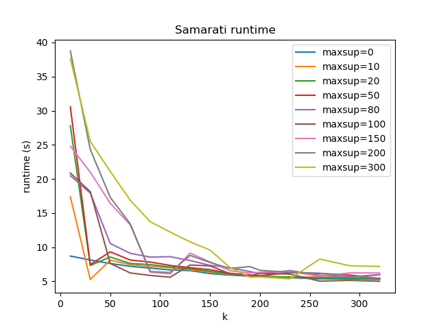
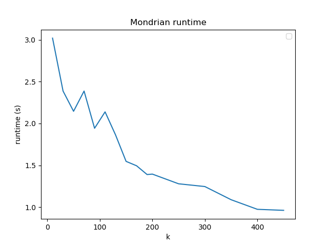
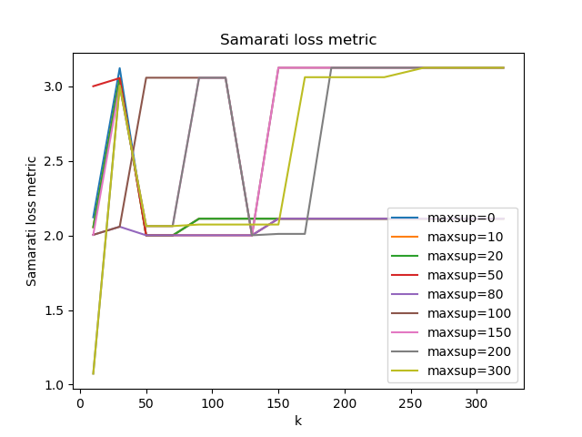
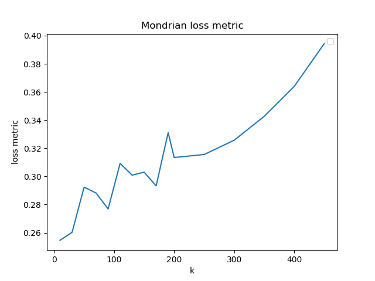

# K-Anonymity

**郑龙韬 PB18061352**
**5/20/2021**

## Problem Statement

Given a table to be generalized, every QI-cluster should contains k or more tuples after the k-anonymization.

### Dataset

- [adult.data](https://archive.ics.uci.edu/ml/datasets/adult) 
  
  Attributes include 'age', 'work_class', 'final_weight', 'education', 'education_num', 'marital_status', 'occupation', 'relationship', 'race', 'sex', 'capital_gain', 'capital_loss', 'hours_per_week', 'native_country', and 'class'.
- adult_*.txt: there are 2 strings in each row, separated by a comma. The left one represents the children node, and the right one represents the parent node.

## Algorithms

### Samarati (categorical)

In [samarati.py](algorithms/samarati.py), we implement a class `Lattice` and a method `samarati()`. Selected vectors are generalized and validated in methods of `Lattice`. See User Guide section for examples.

### Mondrian (numerical)

In [mondrian.py](algorithms/mondrian.py), we build a class `Partition` and a method `mondrian()`. Recursive anonymization is implemented in `Partition.strict_anonymize()`. At each timestep, the dimension to be split is randomly selected. See User Guide section for examples.

## User Guide

To run samarati with k = 10 and maxsup = 20:
```bash
python main.py --samarati --k 10 --maxsup 20
```

To get optimal solution for samarati:
```bash
python main.py --samarati --k 10 --maxsup 20 --optimal-samarati
```

To run mondrian with k = 10:
```bash
python main.py --mondrian --k 10
```

The data path, hierarchy paths and other configurations can be easily editied in the dictionary `default_data_config` in [utils/\_\_init\_\_.py](utils/__init__.py).

The results will be saved in directory [results/samarati.csv](results/samarati.csv) and [results/mondrian.csv](results/mondrian.csv) in csv format.

Code structure:
- algorithms:
  - [samarati.py](algorithms/mondrian.py)
  - [mondrian.py](algorithms/mondrian.py)
- data: dataset and generalization hierarchies
- results: directory where anonymized tables are saved
- utils:
  - data loader
  - loss metrics
  - display table
  - default data configuration
- main.py
- plot.py

See more argument setting description:
```bash
python main.py --help
```

To plot the relations between runtime/loss metric and different k/maxsup for Samarati and Mondrian (ranges of k and maxsup can be adjusted in the code), run [plot.py](plot.py):
```bash
python plot.py --samarati
```
or
```bash
python plot.py --mondrian
```


## Results & Analysis

Run vanilla Samarati:
```bash
python main.py --samarati --k 10 --maxsup 20
```

Output for vanilla samarati (k=10, maxsup=20) is as follows. After `configuration`, the following 2 lines of row count indicating the drop of rows with '?'.
- `hierarchies` maps a value to its parent in the generalization hierarchy
- `hierarchy heights` maps attribute names to its height in the generalization hierarchy
- `lattice map` records vectors for each height in the lattice
- `leaves num` records leaves in the subtree rooted by values in each attribute
- `loss metric map` records loss metric of values in each attribute

In the last part there are `loss metric`, `generalization vector`, `max suppression`, `quasi identifiers` and `anonymized table` (after replacing the quasi-identifiers and droping the sensitive column, both shown in standard output and saved in [results](results) directory)

```
configuration:
 {'k': 10, 'maxsup': 20, 'samarati': True, 'mondrian': False, 'optimal_samarati': False, 'data': {'path': 'data/adult.data', 'samarati_quasi_id': ['age', 
'gender', 'race', 'marital_status'], 'mondrian_quasi_id': ['age', 'education_num'], 'sensitive': 'occupation', 'columns': ['age', 'work_class', 'final_weight', 'education', 'education_num', 'marital_status', 'occupation', 'relationship', 'race', 'gender', 'capital_gain', 'capital_loss', 'hours_per_week', 'native_country', 'class'], 'samarati_generalization_type': {'age': 'range', 'gender': 'categorical', 'race': 'categorical', 'marital_status': 'categorical'}, 'hierarchies': {'age': None, 'gender': 'data/adult_gender.txt', 'race': 'data/adult_race.txt', 'marital_status': 'data/adult_marital_status.txt'}, 'mondrian_generalization_type': {'age': 'numerical', 'education_num': 'numerical'}}}

row count before sanitizing: 32561
row count sanitized: 30162

hierarchies:
 {'age': {'39': '(35, 40)', '50': '(50, 55)', '38': '(35, 40)', '53': '(50, 55)', '28': '(25, 30)', '37': '(35, 40)', '49': '(45, 50)', '52': '(50, 55)', 
'31': '(30, 35)', '42': '(40, 45)', '30': '(30, 35)', '23': '(20, 25)', '32': '(30, 35)', '34': '(30, 35)', '25': '(25, 30)', '43': '(40, 45)', '40': '(40, 45)', '54': '(50, 55)', '35': '(35, 40)', '59': '(55, 60)', '56': '(55, 60)', '19': '(15, 20)', '20': '(20, 25)', '45': '(45, 50)', '22': '(20, 25)', '48': '(45, 50)', '21': '(20, 25)', '24': '(20, 25)', '57': '(55, 60)', '44': '(40, 45)', '41': '(40, 45)', '29': '(25, 30)', '47': '(45, 50)', '46': '(45, 
50)', '36': '(35, 40)', '79': '(75, 80)', '27': '(25, 30)', '18': '(15, 20)', '33': '(30, 35)', '76': '(75, 80)', '55': '(55, 60)', '61': '(60, 65)', '70': '(70, 75)', '64': '(60, 65)', '71': '(70, 75)', '66': '(65, 70)', '51': '(50, 55)', '58': '(55, 60)', '26': '(25, 30)', '17': '(15, 20)', '60': '(60, 65)', '90': '(90, 95)', '75': '(75, 80)', '65': '(65, 70)', '77': '(75, 80)', '62': '(60, 65)', '63': '(60, 65)', '67': '(65, 70)', '74': '(70, 75)', '72': 
'(70, 75)', '69': '(65, 70)', '68': '(65, 70)', '73': '(70, 75)', '81': '(80, 85)', '78': '(75, 80)', '88': '(85, 90)', '80': '(80, 85)', '84': '(80, 85)', '83': '(80, 85)', '85': '(85, 90)', '82': '(80, 85)', '86': '(85, 90)', '(35, 40)': '(30, 40)', '(50, 55)': '(50, 60)', '(25, 30)': '(20, 30)', '(45, 50)': '(40, 50)', '(30, 35)': '(30, 40)', '(40, 45)': '(40, 50)', '(20, 25)': '(20, 30)', '(55, 60)': '(50, 60)', '(15, 20)': '(10, 20)', '(75, 80)': '(70, 
80)', '(60, 65)': '(60, 70)', '(70, 75)': '(70, 80)', '(65, 70)': '(60, 70)', '(90, 95)': '(90, 100)', '(80, 85)': '(80, 90)', '(85, 90)': '(80, 90)', '(30, 40)': '(20, 40)', '(50, 60)': '(40, 60)', '(20, 30)': '(20, 40)', '(40, 50)': '(40, 60)', '(10, 20)': '(0, 20)', '(70, 80)': '(60, 80)', '(60, 70)': '(60, 80)', '(90, 100)': '(80, 100)', '(80, 90)': '(80, 100)', '(20, 40)': '*', '(40, 60)': '*', '(0, 20)': '*', '(60, 80)': '*', '(80, 100)': '*'}, 'gender': {'Female': '*', 'Male': '*'}, 'race': {'Other': '*', 'Amer-Indian-Eskimo': '*', 'Black': '*', 'White': '*', 'Asian-Pac-Islander': '*'}, 'marital_status': {'NM': '*', 'Married': '*', 'leave': '*', 'alone': '*', 'Never-married': 'NM', 'Married-civ-spouse': 'Married', 'Married-AF-spouse': 'Married', 'Divorced': 'leave', 'Separated': 'leave', 'Widowed': 'alone', 'Married-spouse-absent': 'alone'}}

hierarchy heights:
 {'age': 4, 'gender': 1, 'race': 1, 'marital_status': 2}

lattice_map:
 {0: [(0, 0, 0, 0)], 1: [(0, 0, 0, 1), (0, 0, 1, 0), (0, 1, 0, 0), (1, 0, 0, 0)], 2: [(0, 0, 0, 2), (0, 0, 1, 1), (0, 1, 0, 1), (0, 1, 1, 0), (1, 0, 0, 1), (1, 0, 1, 0), (1, 1, 0, 0), (2, 0, 0, 0)], 3: [(0, 0, 1, 2), (0, 1, 0, 2), (0, 1, 1, 1), (1, 0, 0, 2), (1, 0, 1, 1), (1, 1, 0, 1), (1, 1, 1, 0), (2, 0, 
0, 1), (2, 0, 1, 0), (2, 1, 0, 0), (3, 0, 0, 0)], 4: [(0, 1, 1, 2), (1, 0, 1, 2), (1, 1, 0, 2), (1, 1, 1, 1), (2, 0, 0, 2), (2, 0, 1, 1), (2, 1, 0, 1), (2, 1, 1, 0), (3, 0, 0, 1), (3, 0, 1, 0), (3, 1, 0, 0), (4, 0, 0, 0)], 5: [(1, 1, 1, 2), (2, 0, 1, 2), (2, 1, 0, 2), (2, 1, 1, 1), (3, 0, 0, 2), (3, 0, 1, 1), (3, 1, 0, 1), (3, 1, 1, 0), (4, 0, 0, 1), (4, 0, 1, 0), (4, 1, 0, 0)], 6: [(2, 1, 1, 2), (3, 0, 1, 2), (3, 1, 0, 2), (3, 1, 1, 1), (4, 0, 0, 2), (4, 0, 1, 1), (4, 1, 0, 1), (4, 1, 1, 0)], 7: [(3, 1, 1, 2), (4, 0, 1, 2), (4, 1, 0, 2), (4, 1, 1, 1)], 8: [(4, 1, 1, 2)]}

leaves_num:
 {'age': {'(35, 40)': 5, '(50, 55)': 5, '(25, 30)': 5, '(45, 50)': 5, '(30, 35)': 5, '(40, 45)': 5, '(20, 25)': 5, '(55, 60)': 5, '(15, 20)': 3, '(75, 80)': 5, '(60, 65)': 5, '(70, 75)': 5, '(65, 70)': 5, '(90, 95)': 1, '(80, 85)': 5, '(85, 90)': 3, '(30, 40)': 10, '(50, 60)': 10, '(20, 30)': 10, '(40, 50)': 10, '(10, 20)': 3, '(70, 80)': 10, '(60, 70)': 10, '(90, 100)': 1, '(80, 90)': 8, '(20, 40)': 20, '(40, 60)': 20, '(0, 20)': 3, '(60, 80)': 20, '(80, 100)': 9, '*': 72}, 'gender': {'*': 2}, 'race': {'*': 5}, 'marital_status': {'*': 7, 'NM': 1, 'Married': 2, 'leave': 2, 'alone': 2}}

loss_metric_map:
 {'age': {'*': 1, '39': 0, '50': 0, '38': 0, '53': 0, '28': 0, '37': 0, '49': 0, '52': 0, '31': 0, '42': 0, '30': 0, '23': 0, '32': 0, '34': 0, '25': 0, '43': 0, '40': 0, '54': 0, '35': 0, '59': 0, '56': 0, '19': 0, '20': 0, '45': 0, '22': 0, '48': 0, '21': 0, '24': 0, '57': 0, '44': 0, '41': 0, '29': 0, '47': 0, '46': 0, '36': 0, '79': 0, '27': 0, '18': 0, '33': 0, '76': 0, '55': 0, '61': 0, '70': 0, '64': 0, '71': 0, '66': 0, '51': 0, '58': 0, '26': 0, '17': 0, '60': 0, '90': 0, '75': 0, '65': 0, '77': 0, '62': 0, '63': 0, '67': 0, '74': 0, '72': 0, '69': 0, '68': 0, '73': 0, '81': 0, '78': 0, '88': 0, '80': 0, '84': 0, '83': 0, '85': 0, '82': 0, '86': 0, '(35, 40)': 0.056338028169014086, '(50, 55)': 0.056338028169014086, '(25, 30)': 0.056338028169014086, '(45, 50)': 0.056338028169014086, '(30, 35)': 0.056338028169014086, '(40, 45)': 0.056338028169014086, '(20, 25)': 0.056338028169014086, '(55, 60)': 0.056338028169014086, '(15, 20)': 0.028169014084507043, '(75, 80)': 0.056338028169014086, '(60, 65)': 0.056338028169014086, '(70, 75)': 0.056338028169014086, '(65, 70)': 0.056338028169014086, '(90, 95)': 0.0, '(80, 85)': 0.056338028169014086, '(85, 90)': 0.028169014084507043, '(30, 40)': 0.1267605633802817, '(50, 60)': 0.1267605633802817, '(20, 30)': 0.1267605633802817, '(40, 50)': 0.1267605633802817, '(10, 20)': 0.028169014084507043, '(70, 80)': 0.1267605633802817, '(60, 70)': 0.1267605633802817, '(90, 100)': 0.0, '(80, 90)': 0.09859154929577464, '(20, 40)': 0.2676056338028169, '(40, 60)': 0.2676056338028169, '(0, 20)': 0.028169014084507043, '(60, 80)': 0.2676056338028169, '(80, 100)': 0.11267605633802817}, 'gender': {'*': 1, 'Female': 0, 'Male': 0}, 'race': {'*': 1, 'Other': 0, 'Amer-Indian-Eskimo': 0, 'Black': 0, 'White': 0, 'Asian-Pac-Islander': 0}, 'marital_status': {'*': 1, 'NM': 0.0, 'Married': 0.16666666666666666, 'leave': 0.16666666666666666, 'alone': 0.16666666666666666, 'Never-married': 0, 'Married-civ-spouse': 0, 'Married-AF-spouse': 0, 'Divorced': 0, 'Separated': 0, 'Widowed': 0, 'Married-spouse-absent': 0}}

====================

loss_metric: 2.0554451968758123
generalization vector: (1, 0, 1, 2)
max suppression: 7

====================
anonymized table:
             age  gender race marital_status         occupation
0      (35, 40)    Male    *              *       Adm-clerical
2      (35, 40)    Male    *              *  Handlers-cleaners
10     (35, 40)    Male    *              *    Exec-managerial
18     (35, 40)    Male    *              *              Sales
22     (35, 40)    Male    *              *    Farming-fishing
...         ...     ...  ...            ...                ...
19045  (80, 85)  Female    *              *      Other-service
19495  (80, 85)  Female    *              *    Exec-managerial
19515  (80, 85)  Female    *              *      Other-service
20482  (80, 85)  Female    *              *       Adm-clerical
26731  (80, 85)  Female    *              *     Prof-specialty

[30155 rows x 5 columns]
====================
```

Run Mondrian:

```bash
python main.py --mondrian
```

Output for Mondrian (detailed csv in [results](results)):

```
configuration:
 {'k': 10, 'maxsup': 20, 'samarati': False, 'mondrian': True, 'optimal_samarati': False, 'data': {'path': 'data/adult.data', 'samarati_quasi_id': ['age', 
'gender', 'race', 'marital_status'], 'mondrian_quasi_id': ['age', 'education_num'], 'sensitive': 'occupation', 'columns': ['age', 'work_class', 'final_weight', 'education', 'education_num', 'marital_status', 'occupation', 'relationship', 'race', 'gender', 'capital_gain', 'capital_loss', 'hours_per_week', 'native_country', 'class'], 'samarati_generalization_type': {'age': 'range', 'gender': 'categorical', 'race': 'categorical', 'marital_status': 'categorical'}, 'hierarchies': {'age': None, 'gender': 'data/adult_gender.txt', 'race': 'data/adult_race.txt', 'marital_status': 'data/adult_marital_status.txt'}, 'mondrian_generalization_type': {'age': 'numerical', 'education_num': 'numerical'}}}

row count before sanitizing: 32561
row count sanitized: 30162
D:\2021spring\Privacy\data-privacy-ustc\lab\k-anonymity\algorithms\mondrian.py:59: SettingWithCopyWarning: 
A value is trying to be set on a copy of a slice from a DataFrame.
Try using .loc[row_indexer,col_indexer] = value instead

See the caveats in the documentation: http://pandas.pydata.org/pandas-docs/stable/user_guide/indexing.html#returning-a-view-versus-a-copy
  self.table[dim] = [str(min_val) + '-' + str(max_val)] * self.table.shape[0]

====================

loss_metric: 0.26420934260927065

====================
anonymized table:
          age education_num       occupation
209       17           3-7            Sales
262       17           3-7    Other-service
271       17           3-7    Other-service
335       17           3-7    Other-service
371       17           3-7    Other-service
...      ...           ...              ...
19861  77-90         15-16  Farming-fishing
20483  77-90         15-16   Prof-specialty
21835  77-90         15-16  Exec-managerial
23868  77-90         15-16  Exec-managerial
28176  77-90         15-16  Exec-managerial

[30162 rows x 3 columns]
====================
```

### Runtime

- Samarati runtime with different k and maxsup:

  

- Mondrian runtime with different k:

  

### Loss Metric

- Samarati loss metric with different k and maxsup:

  

- Mondrian loss metric with different k:

  

According to the figures above, we can draw the conclusion that for both algorithms
- runtime decreases as k increases
- loss metric increases as k increases
- for Samarati, increasing maxsup may lead to longer runtime and higher loss metric. 

These results are reasonable, since **greater k results in more abstract generalization**. Therefore, the loss metric will increase. 

On the other hand, the algorithm will **consider more possible cases with greater maxsup** (more tuples are allowed to be suppressed). **With greater k, the algorithm will exit earlier since it finds that there exists no satisfied tables** more quickly, so the runtime drops as k increases.

Also, the trivial fluctuation in the two figures for Mondrian may result from different random seed when conducting experiments.

The loss metric for categorical data is (M − 1)/(|A| − 1), where |A| represents the total number of leaf nodes in the generalization tree, and M represents the number of leaf nodes in the subtree rooted at x (generalized value in the anonymized table). 

Note: **the attribute age for Samarati is generalized as categorical data rather than numerical data**. In provided dataset, there are some values like 87 and 89 is lacked. It is not suitable to calculate its loss metric as numerical one in the next passage. In this implementation, a hierarchy tree is built for age attribute, just like other categorical attributes. 

For numerical data, suppose the value of a tuple has been generalized to an interval [L_i, U_i]. Letting the lower and upper bounds in the table for A be L and U. The normalized loss for this entry is given by (U_i - L_i) / (U - L). (e.g., the loss for [20 - 30] is (30 - 20) / (40 - 20) if the upper and lower bound in the attribute are 40 and 20)


## Discussion & Conclusion

In conclusion, Mondrian runs faster than Samarati, plus lower loss metric. However, numerical generalization can be regarded as a special type of categorical generalization, so Samarati can be applied to numerical data. 

Though Mondrian is originally only applied for numerical data, it is possible to be extended for categorical data, as described in the next section.

There may exists multiple feasible solutions for Samarati algorithm. The next section provides two approaches to find the optimal solution.

## Addition

### Optimal result for Samarati

In order to find solution with best utility among all satisfied solutions found by Samarati, here represent 2 convenient approaches.
1) Traverse all satisfied vectors in the lattice, and select the table with the **minimum loss metric**. This is implemented in [samarati.py](algorithms/samarati.py). 
2) It is more efficient to **bi-directionally traverse the lattice starting from the height of vector provided by vanilla Samarati**. Intuitively, it's meaningless to consider a vector if it's parent in the lattice is already satisfied, which leads to higher loss metric. This pruning trick can reduce the number of nodes visited, resulting in less runtime.
   The pseudo code is here:
    ```
    Build a lattice
    excluded_list = []  # pruning non-sense search if one of parents satisfies or current node satisfies and none of successors unsatisfies
    up_frontier = []  # maintain nodes to extend upward
    down_frontier = []  # maintain nodes to extend downward
    final_list = []  # final vectors to choose from (by min loss metric)

    Consider vectors at given height by vanilla Samarati
    add satisfied vectors to down_frontier
    add unsatisfied vectors to up_frontier
    while up_frontier:
      v = pop one from the up_frontier
      if v is satisfied:
        Add v to final_list
        Add the satisfied successor to the excluded_list
        Stop traversing the successor's successor  # pruning
      else:
        Add all of its successors to up_frontier
      end if
    end while
    while down_frontier:
      v = pop one from the down_frontier
      if v is satisfied and none of v's parents is so:
        Add it to the final_list
        Add all parents to the excluded_list  # pruning
      else:
        Add all of its parents to the down_frontier
      end if
    end while

    Select the table with the minimum loss metric from the final list.
    ```


The selected optimal generalization vector is (4, 0, 0, 1), and the optimal loss metric is 1.1141447295713969, as illustrated below.


Run:
```bash
python main.py --samarati --k 10 --maxsup 20 --optimal-samarati
```

Output for optimal samarati (approach #1):

```
... # omitted contents above are similar to vanilla samarati's output

number of all possible solutions: 19

====================

loss_metric: 1.1141447295713969
generalization vector: (4, 0, 0, 1)
max suppression: 13

====================
anonymized table:
       age  gender   race marital_status         occupation
0       *    Male  White             NM       Adm-clerical
16      *    Male  White             NM    Farming-fishing
17      *    Male  White             NM  Machine-op-inspct
26      *    Male  White             NM       Craft-repair
30      *    Male  White             NM    Protective-serv
...    ..     ...    ...            ...                ...
21131   *  Female  Other          alone      Other-service
22376   *  Female  Other          alone      Other-service
24046   *  Female  Other          alone  Machine-op-inspct
28683   *  Female  Other          alone              Sales
31873   *  Female  Other          alone      Other-service

[30149 rows x 5 columns]
====================
```

### Mondrian for categorical attribute

In [data_loader.py](utils/data_loader.py), there implemented two methods `preprocess_categorical_column` and `recover_categorical_mondrian`, converting categorical values to numerical encoding (from 0 to n-1) and recovering/interpreting numerical encoding to original values, respectively. 

Mondrian algorithms can then directly be applied to encoded data. After generalization, the way to interpret assigned encoded values (or ranges) can be customed in the `recover_categorical_mondrian` method (in the example we ignore recovering '0-1' for convenience).

Take attribute `gender` as an example. `[Male, Female]` is encoded as `[0, 1]`. To run this example, edit [utils/\_\_init\_\_.py](utils/__init__.py) as follows:
- uncomment the line `'gender': 'categorical'` in the `default_data_config[mondrian_generalization_type]` 
- change `'mondrian_quasi_id': ['age', 'education_num']` to `'mondrian_quasi_id': ['age', 'gender', 'education_num']`

After editing configuration, run:
```bash
python main.py --mondrian --k 10
```

Output:
```
configuration:
 {'k': 10, 'maxsup': 20, 'samarati': False, 'mondrian': True, 'optimal_samarati': False, 'data': {'path': 'data/adult.data', 'samarati_quasi_id': ['age', 'gender', 'race', 'marital_status'], 'mondrian_quasi_id': ['age', 'gender', 'education_num'], 'sensitive': 'occupation', 'columns': ['age', 'work_class', 'final_weight', 'education', 'education_num', 'marital_status', 'occupation', 'relationship', 'race', 'gender', 'capital_gain', 'capital_loss', 'hours_per_week', 'native_country', 'class'], 'samarati_generalization_type': {'age': 'range', 'gender': 'categorical', 'race': 'categorical', 'marital_status': 'categorical'}, 'hierarchies': {'age': None, 'gender': 'data/adult_gender.txt', 'race': 'data/adult_race.txt', 'marital_status': 'data/adult_marital_status.txt'}, 'mondrian_generalization_type': {'age': 'numerical', 'gender': 'categorical', 'education_num': 'numerical'}}}    

row count before sanitizing: 32561
row count sanitized: 30162

====================

loss_metric: 1.1994430683139055

====================
quasi iden in table
          age gender education_num
209       17    0-1           3-7
262       17    0-1           3-7
271       17    0-1           3-7
335       17    0-1           3-7
371       17    0-1           3-7
...      ...    ...           ...
20483  68-80    0-1            16
21473  68-80    0-1            16
23460  68-80    0-1            16
26431  68-80    0-1            16
28176  68-80    0-1            16

[30162 rows x 3 columns]
====================


====================
anonymized table
          age        work_class  final_weight  education  ... capital_loss hours_per_week native_country  class
209       17           Private         65368       11th  ...            0             12  United-States  <=50K
262       17           Private        245918       11th  ...            0             12  United-States  <=50K
271       17           Private        191260        9th  ...            0             24  United-States  <=50K
335       17           Private        270942    5th-6th  ...            0             48         Mexico  <=50K
371       17           Private         89821       11th  ...            0             10  United-States  <=50K
...      ...               ...           ...        ...  ...          ...            ...            ...    ...
20483  68-80         Local-gov        146244  Doctorate  ...            0             40  United-States  <=50K
21473  68-80  Self-emp-not-inc        173929  Doctorate  ...            0             25  United-States   >50K
23460  68-80           Private        230417  Doctorate  ...            0             40          China   >50K
26431  68-80           Private        194746  Doctorate  ...            0             40           Cuba  <=50K
28176  68-80       Federal-gov         62176  Doctorate  ...            0              6  United-States   >50K

[30162 rows x 15 columns]
====================
```

## References
1) Samarati P. Protecting respondents identities in microdata release[J]. IEEE transactions on Knowledge and Data Engineering, 2001. 
2) LeFevre K, DeWitt D J, Ramakrishnan R. Mondrian multidimensional k-anonymity[C]. (ICDE'06). IEEE, 2006.
3) V. S. Iyengar, "Transforming data to satisfy privacy constraints" in ACM SIGKDD International Conference on Knowledge Discovery and Data Mining, 2002.
4) **Methodology, Ethics and Practice of Data Privacy** Course at University of Science and Technology of China. 2021 Spring. (**Lecturer: Prof. Lan Zhang**).
